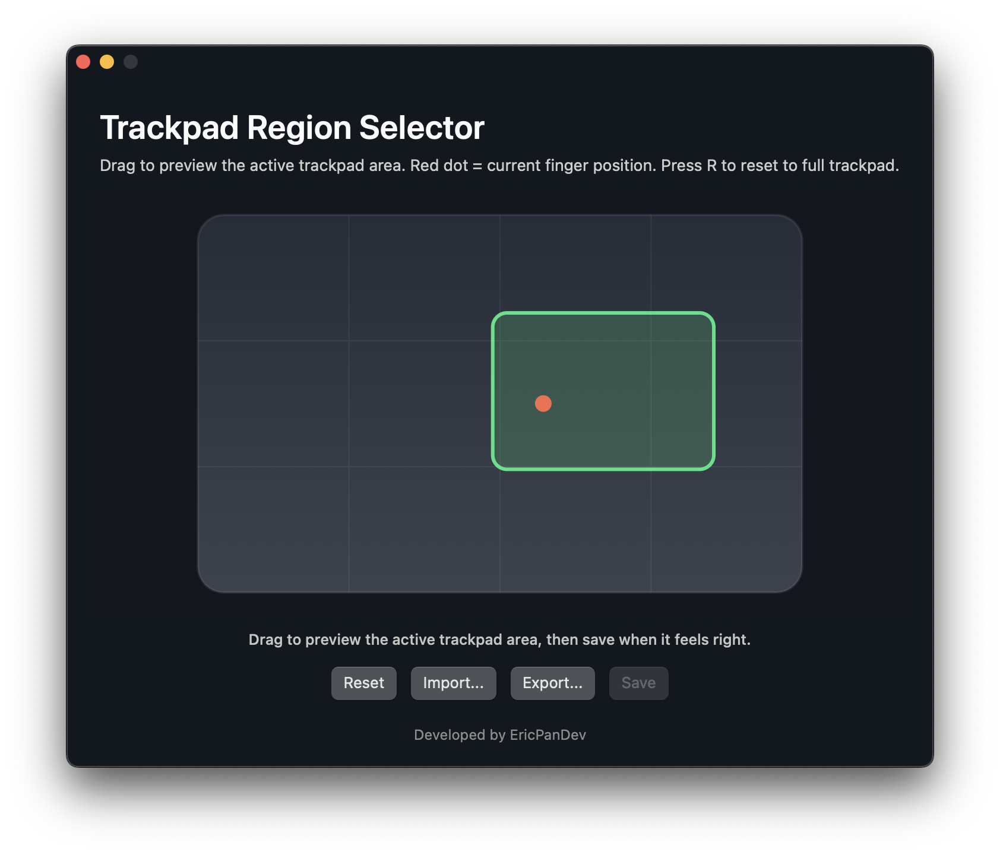

# Mac Trackpad OSU Tablet

Use your Mac trackpad as an osu! tablet.



## Install
Press Command+Space then search for "Terminal"
Copy paste the line below into terminal and press enter to install.
```bash
/bin/zsh -c "$(curl -fsSL https://github.com/EricPanDev/Mac-Trackpad-OSU-Tablet/raw/main/setup.sh)"
```
